#  SocialTube

> A modern full-stack MERN video streaming and social interaction platform inspired by YouTube.

---

# Live Demo

## Frontend

[Social Tube Project Link](https://social-tube-xi.vercel.app)

##  Backend API

Render Backend Link : https://social-tube-backend.onrender.com

---

## Social Tube Model

[Model Link](https://app.eraser.io/workspace/YtPqZ1VogxGy1jzIDkzj)

<br>

# Project Preview

##  Home Page

> 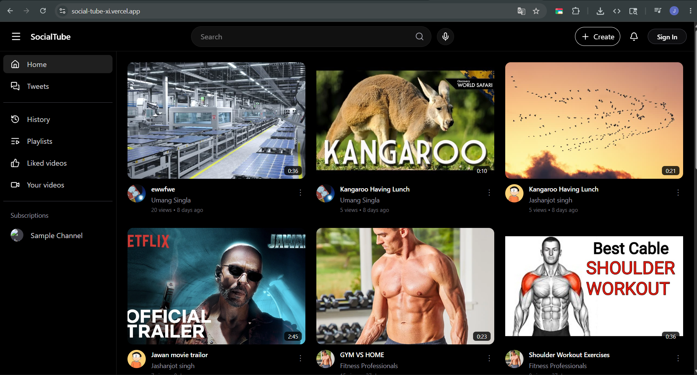


---

##  Video Watch Page

> 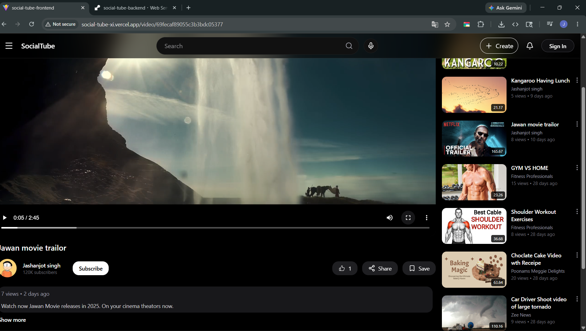

# Comment Section
>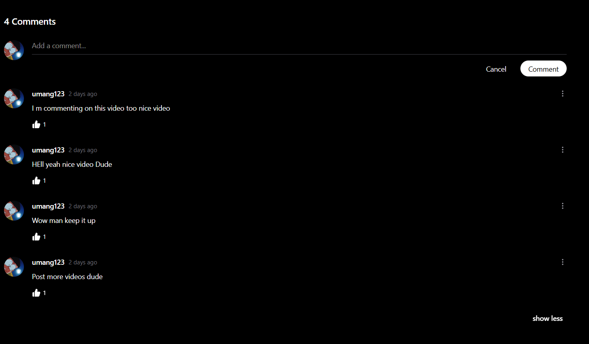

---

## 📂 Playlist System

> 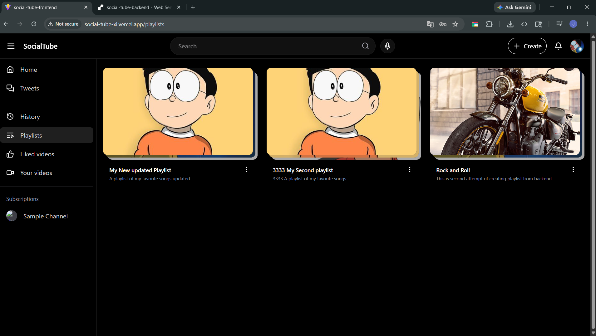


# Save to playlist modal
>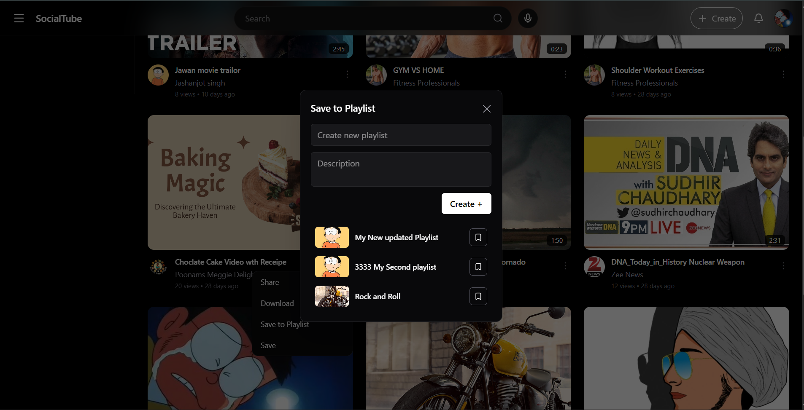

# Playlist autoplay UI
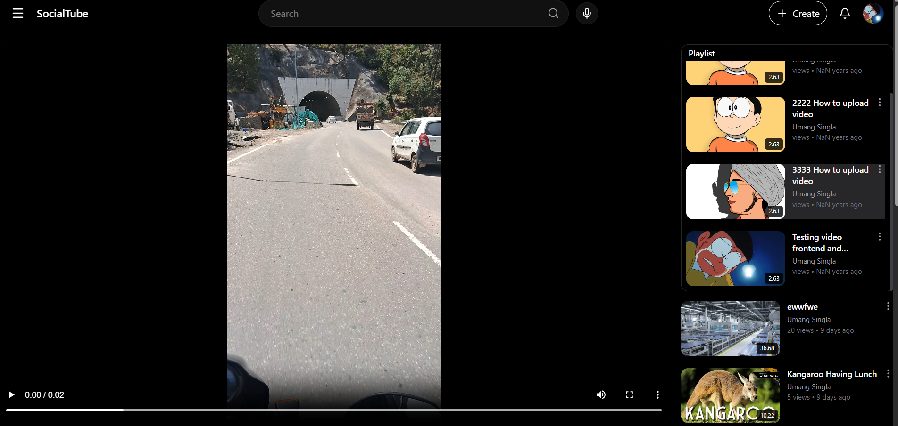

---

## 👤 Channel / Profile Page

> 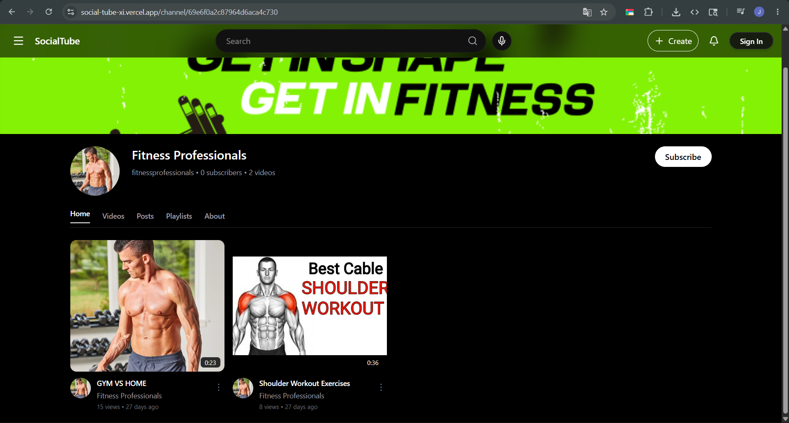


---

## 💬 Tweet / Post System

> 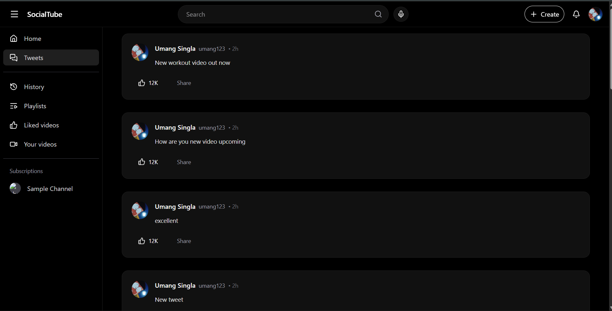

---

## Authentication

#Registeration Page
> 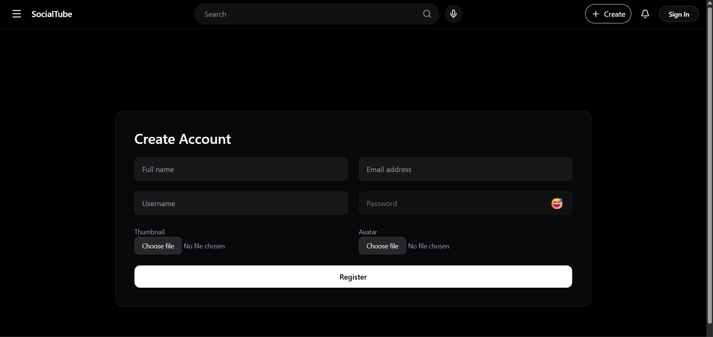

---

## API Testing (Postman)

> 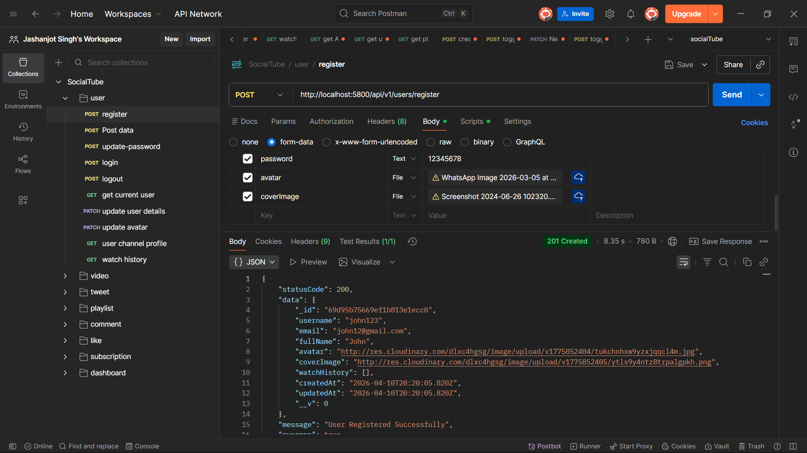


---

##  Deployment

### ▲ Vercel Frontend Deployment

> 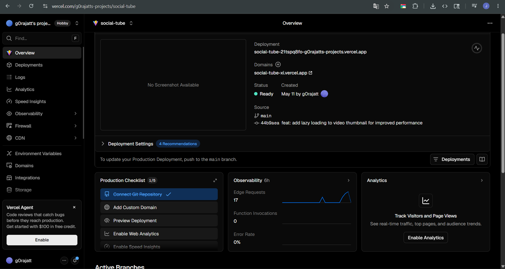

# Render Backend Deployment

## Render Browser Result

> 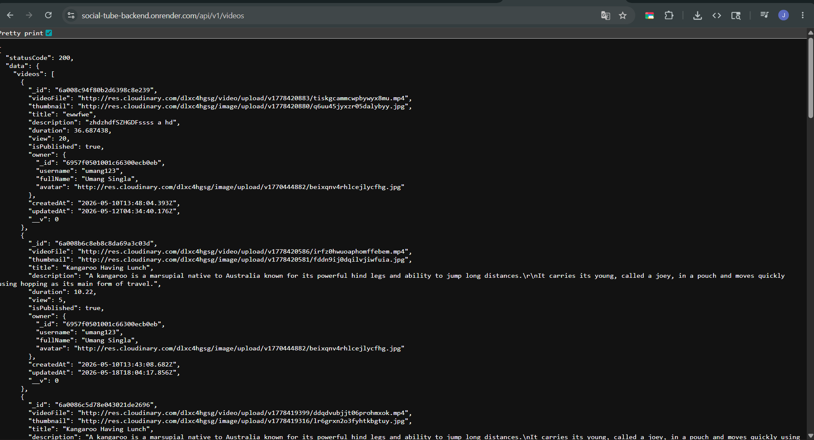

###  MongoDB Atlas Database

> 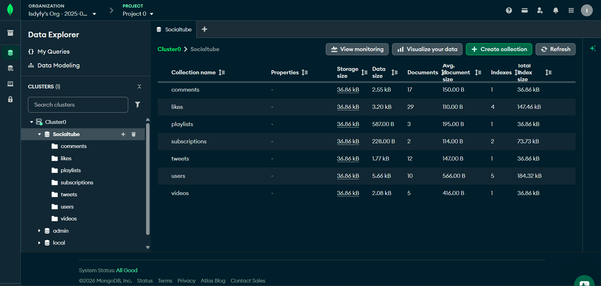
---

#  Features

##  Authentication System

* User registration and login
* JWT access & refresh token authentication
* Secure cookies-based authentication
* Protected routes
* Persistent login system

---

##  Video System

* Upload videos
* Watch videos
* Dynamic video details page
* Suggested videos section
* Responsive video cards
* Infinite scrolling with pagination
* Lazy loading thumbnails
* Skeleton loading UI

---

##  Like System

* Like and unlike videos
* Real-time UI updates
* Dynamic like count handling

---

##  Comments System

* Add comments
* Show more comments functionality
* Dynamic comment rendering

---

## Playlist System

* Create playlists
* Save videos to playlists
* Remove videos from playlists
* Playlist autoplay logic
* Playlist modal popup

---

##  User Features

* Channel page
* Watch history
* Subscription system
* Profile avatar dropdown

---

##  Tweet System

* Short text posting feature
* Social interaction support

---

# Tech Stack

## Frontend

* React.js
* Vite
* Redux Toolkit
* React Router DOM
* Tailwind CSS
* Lucide React
* Axios

---

## Backend

* Node.js
* Express.js
* JWT Authentication
* Multer
* Cloudinary
* REST APIs

---

## Database

* MongoDB Atlas
* Mongoose

---

## Deployment

* Vercel (Frontend)
* Render (Backend)

---

# UI / Design System

* Dark modern UI inspired by YouTube
* Zinc / neutral color palette
* Responsive grid layout
* Smooth hover animations
* Skeleton loading effects
* Lazy loaded thumbnails
* Infinite scrolling feed

---

# Performance Optimizations

* Pagination system
* Infinite scrolling
* Lazy image loading
* Optimized API responses
* Mongoose `.lean()` queries
* Selective field population
* Cloudinary media optimization

---

# Authentication & Security

## Cookie Configuration

```js
httpOnly: true,
secure: true,
sameSite: "None"
```

## Security Features

* Secure JWT authentication
* Protected backend routes
* Credential-based CORS handling
* Token refresh mechanism

---

# Folder Structure

```bash
SocialTube/
│
├── frontend/
│   ├── src/
│   │   ├── components/
│   │   ├── pages/
│   │   ├── redux/
│   │   ├── api/
│   │   └── utils/
│
├── backend/
│   ├── controllers/
│   ├── models/
│   ├── routes/
│   ├── middlewares/
│   ├── utils/
│   └── public/
│
└── README.md
```

---

# API Endpoints Overview

| Method | Endpoint               | Description      |
| ------ | ---------------------- | ---------------- |
| POST   | /api/v1/users/register | Register user    |
| POST   | /api/v1/users/login    | Login user       |
| POST   | /api/v1/videos         | Upload video     |
| GET    | /api/v1/videos         | Get all videos   |
| GET    | /api/v1/videos/:id     | Get single video |
| POST   | /api/v1/comments       | Add comment      |
| POST   | /api/v1/playlists      | Create playlist  |
| POST   | /api/v1/likes/toggle   | Toggle like      |

---

# Cloudinary Upload Flow

```text
Frontend Upload
      ↓
Multer Middleware
      ↓
Temporary Storage (/tmp)
      ↓
Cloudinary Upload
      ↓
MongoDB Save
```

---

# Key Learnings From Project

* Full-stack MERN architecture
* Redux Toolkit state management
* REST API development
* Authentication systems
* File upload handling
* Deployment workflows
* Infinite scrolling implementation
* Pagination optimization
* Cloudinary integration
* MongoDB data modeling

---

# Future Improvements

* AI generated video summaries
* Real-time notifications
* Video streaming optimization
* Live streaming support
* Recommendation system
* Advanced search filters
* Video analytics dashboard

---

# Author

## Jashanjot Singh

* BCA Final Year Student
* MERN Stack Developer
* Unity & C# Learner
* Passionate about full-stack development

---


# ACKNOWLEDGEMENTS

Special thanks to the following tools and creators for guidance, learning resources, and development support during the creation of SocialTube.

- ChatGPT – Assistance with UI improvements, responsive design ideas, debugging, and optimization concepts.

- GitHub Copilot – Code suggestions and productivity support during development.

- Hitesh Choudhary (Chai aur Code) – MERN stack learning resources, backend architecture guidance, and development concepts.

<br>

---


# ⭐ Support

If you liked this project, give it a ⭐ on GitHub and share your feedback.
